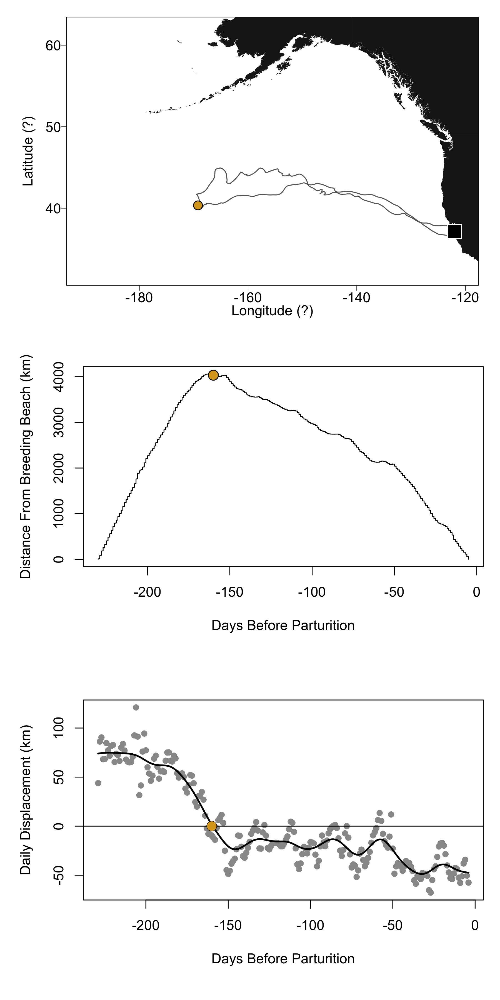

Animal handling methods, biologger specifications, and calculation of arrival and departure dates are described in Robinson, et al. [@robinson2012]. Satellite tracking data were filtered and processed using the R package crawl [@johnson2008; @johnson2016] to eliminate inaccurate location points and interpolate between locations. The resulting latitude and longitude estimates were used to calculate great circle distance (in kilometers) from the Año Nuevo breeding beach (37.1083°N, 122.3366°W) for each time-latitude-longitude point in the MATLAB function `distance()`. Across all seals, foraging trip timing (mean ± SD day-of-year) was as follows: departure 157 ± 9, turnaround 287 ± 40, and arrival 15 ± 8 (Figure 1C). Therefore, outbound trip durations were 130 ± 41 days, and inbound trip durations were 93 ± 41 days. Turnaround dates were calculated using Gaussian kernels with standard deviation 6 hours using custom functions in R. Code and data for a subset of animals are available on GitHub (link available upon review of manuscript) (NOTE: The GitHub repo will be archived on Zenodo, so cite that instead when ready.) Drift rate dates were calculated using a custom MATLAB code based on kernel density estimation of fine-scale changes in depth over time (drift rate, measured in meters/sec) [@robinson2010]. Dates are presented as day-of-year relative to parturition date, with negative numbers indicating dates before pupping. All analyses were carried out in R v4.0.2. A linear mixed-effects model of turnaround date (relative to pupping date) as a function of turnaround distance and buoyancy change date was run in the package lme4 [@bates2015] after scaling and centering the continuous variables and including individual as a random effect.

